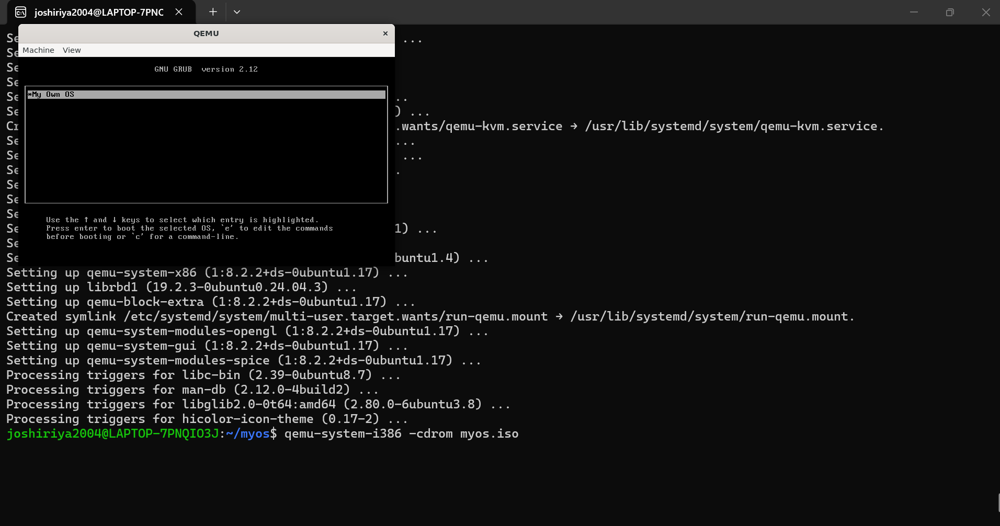
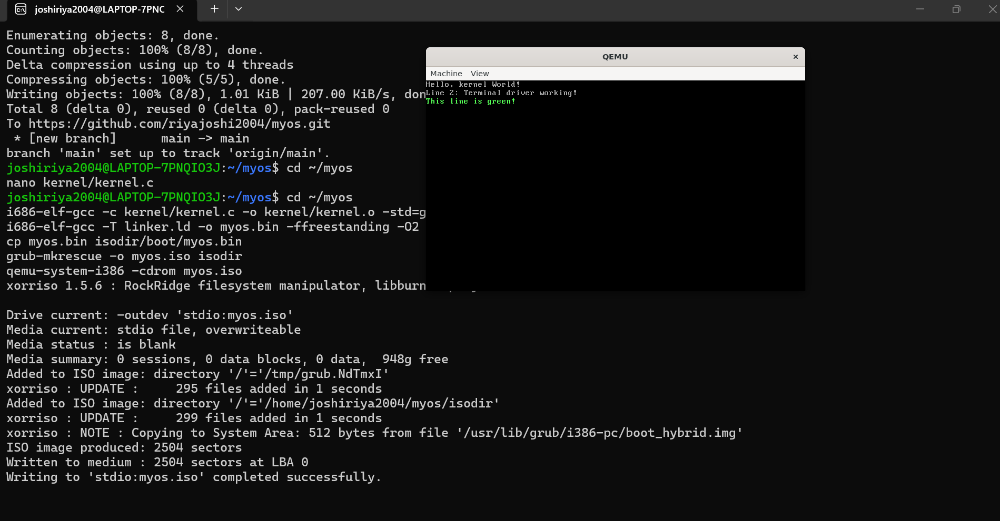
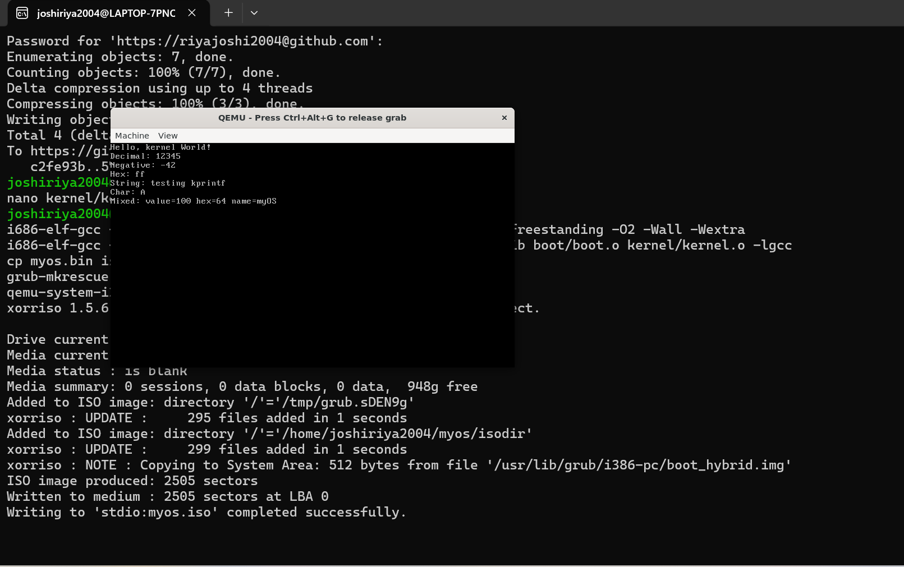
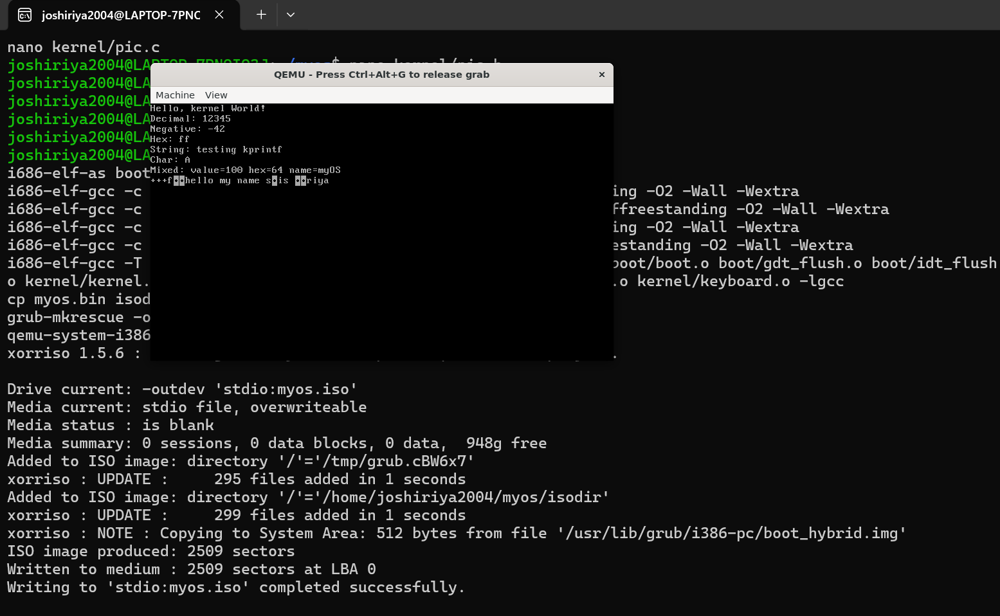
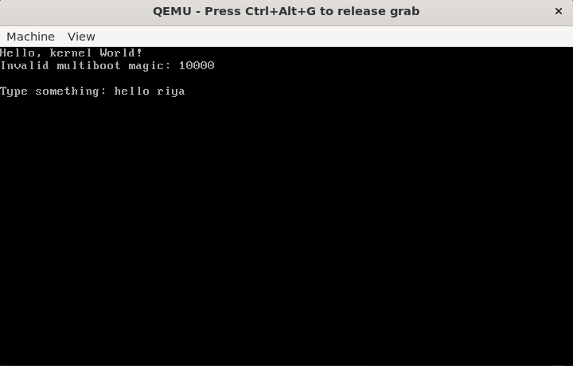
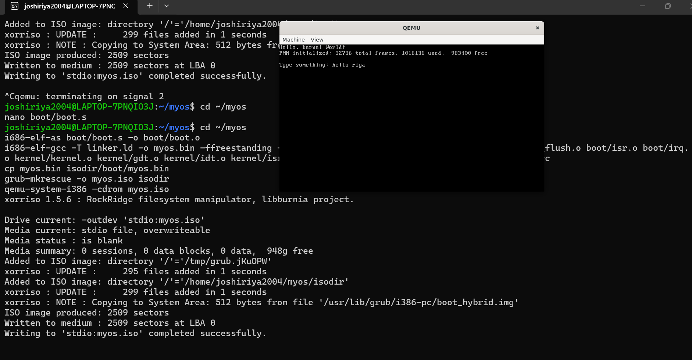
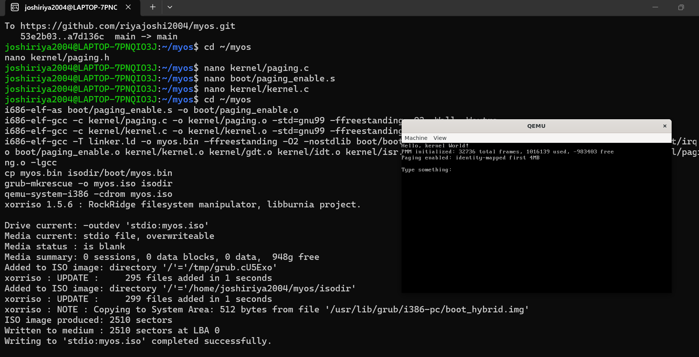
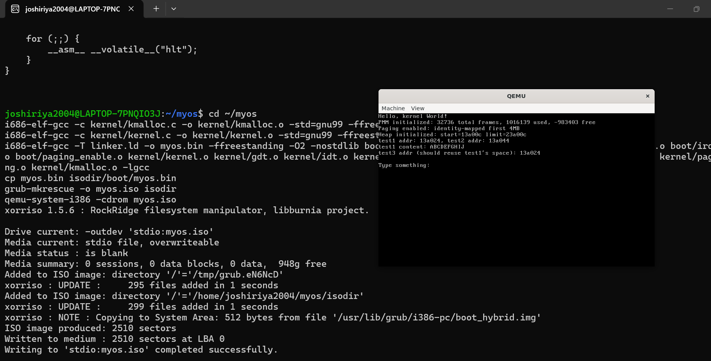

# MyOS — A Hobby Operating System Built From Scratch

A minimal x86 operating system built from the ground up in C and x86 Assembly, without relying on any existing OS kernel or standard library. This project was built to understand how operating systems actually work — from boot to memory management.

## Features Implemented

- **Custom Cross-Compiler Toolchain** — GCC + Binutils built from source, targeting `i686-elf`
- **Multiboot-compliant bootloader integration** — boots via GRUB
- **VGA Text Mode Driver** — custom terminal with scrolling and color support
- **`kprintf`** — a hand-written `printf`-style formatted output function (`%d`, `%x`, `%s`, `%c`)
- **Global Descriptor Table (GDT)** — custom kernel/user code and data segments
- **Interrupt Descriptor Table (IDT)** — full CPU exception handling (divide-by-zero, invalid opcode, page fault, etc.)
- **PIC Remapping** — hardware interrupts properly mapped to avoid CPU exception conflicts
- **PS/2 Keyboard Driver** — live keyboard input via IRQ1
- **Physical Memory Manager (PMM)** — bitmap-based frame allocator using the Multiboot memory map
- **Paging** — virtual memory enabled with identity-mapped first 4MB
- **Heap Allocator (`kmalloc`/`kfree`)** — dynamic memory allocation with free-block reuse


## Screenshots










## Project Structure

```text
myos/
├── boot/
│   ├── boot.s              # Entry point, multiboot header, stack setup
│   ├── gdt_flush.s         # Loads the GDT
│   ├── idt_flush.s         # Loads the IDT
│   ├── isr.s                # CPU exception stubs (0-31)
│   ├── irq.s                # Hardware interrupt stubs (32-47)
│   └── paging_enable.s      # Enables paging via CR0/CR3
├── kernel/
│   ├── src/
│   │   ├── kernel.c          # kernel_main, VGA terminal, kprintf
│   │   ├── gdt.c
│   │   ├── idt.c
│   │   ├── isr.c
│   │   ├── pic.c
│   │   ├── keyboard.c
│   │   ├── pmm.c
│   │   ├── paging.c
│   │   └── kmalloc.c
│   └── include/
│       ├── gdt.h
│       ├── idt.h
│       ├── pic.h
│       ├── pmm.h
│       ├── paging.h
│       ├── kmalloc.h
│       └── multiboot.h
├── screenshots/               # Project screenshots
├── linker.ld                  # Custom memory layout linker script
├── Makefile                   # Build automation
└── isodir/                    # GRUB ISO staging directory
```

## Building From Source

### Prerequisites

You need a custom cross-compiler targeting `i686-elf` (this cannot use your system GCC, since we're building a freestanding kernel).

```bash
sudo apt install build-essential bison flex libgmp3-dev libmpc-dev libmpfr-dev texinfo grub-pc-bin grub-common xorriso qemu-system-x86
```

Cross-compiler setup (Binutils + GCC targeting `i686-elf`) is documented separately — see [OSDev Wiki: GCC Cross-Compiler](https://wiki.osdev.org/GCC_Cross-Compiler).

### Build & Run

```bash
make        # builds myos.iso
make run    # builds and boots it in QEMU
make clean  # removes all build artifacts
```


## Roadmap

- [ ] Backspace/Enter handling + basic shell
- [ ] PIT timer + basic multitasking
- [ ] Shift/Caps Lock keyboard support
- [ ] Filesystem support
- [ ] User mode processes

## Acknowledgments

Built while learning from the [OSDev Wiki](https://wiki.osdev.org) .

## License

MIT License 
